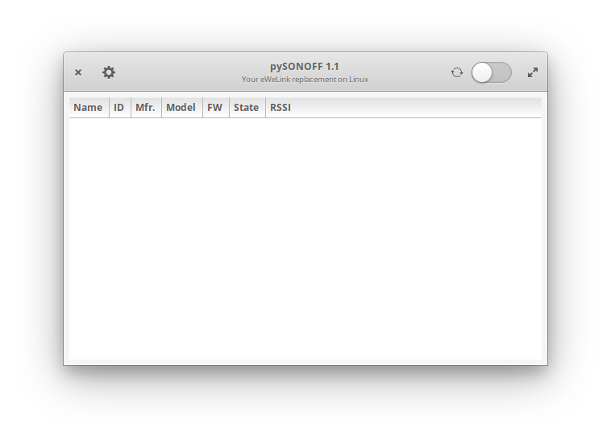
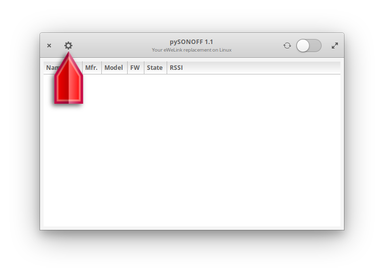
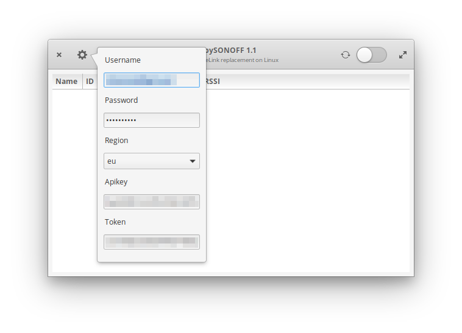
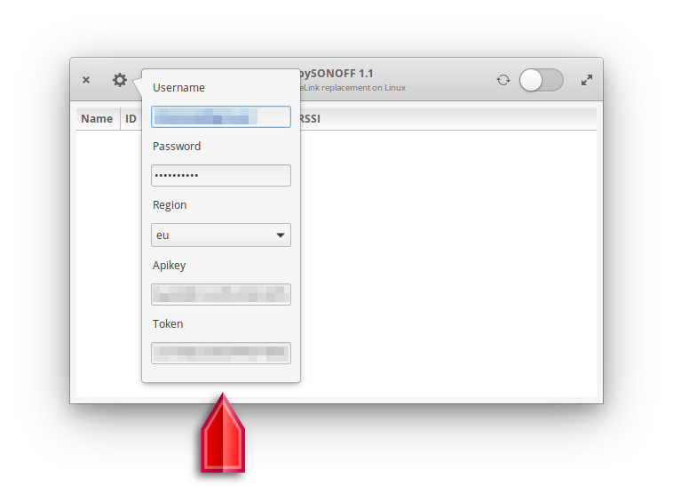
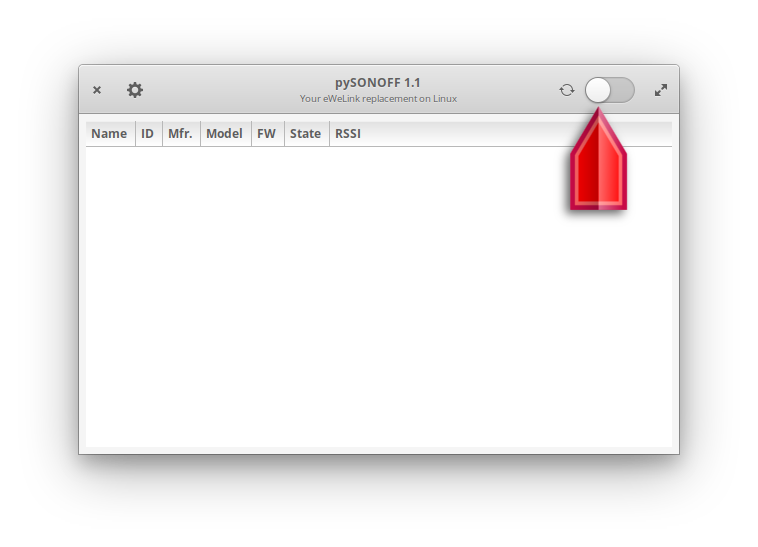
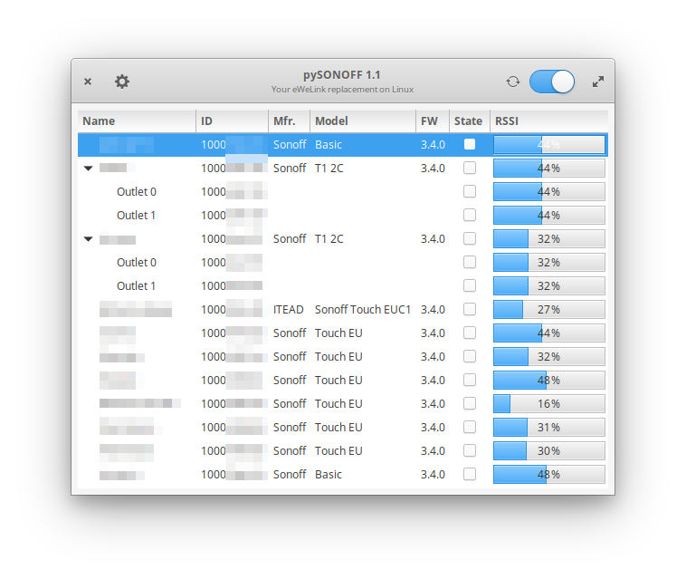
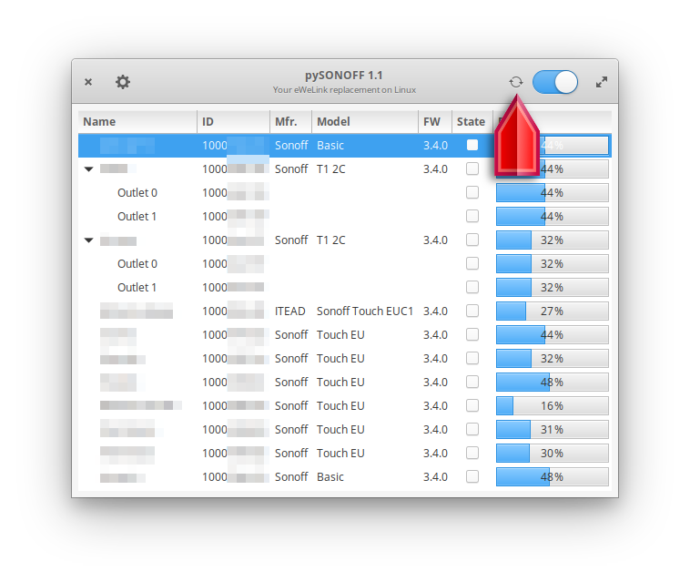
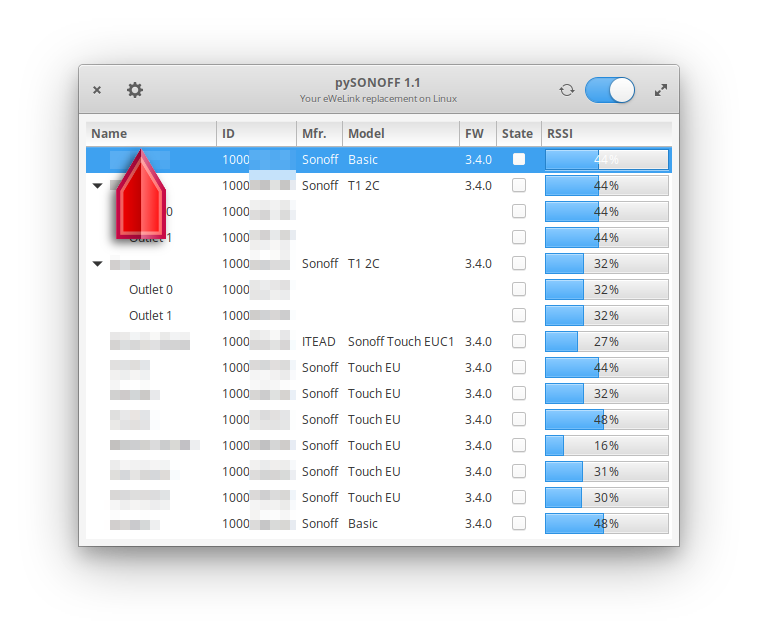
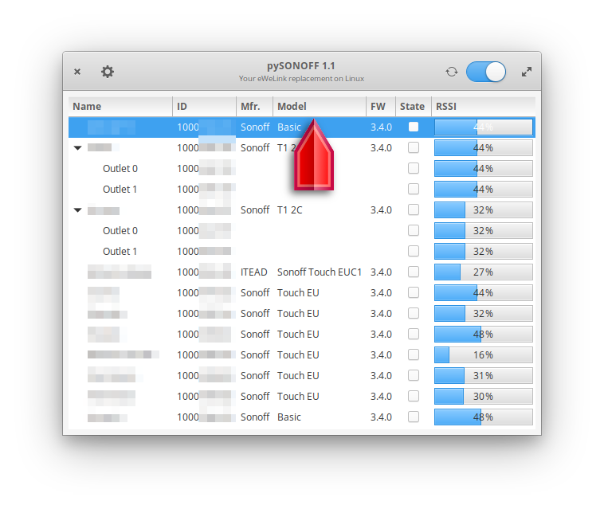
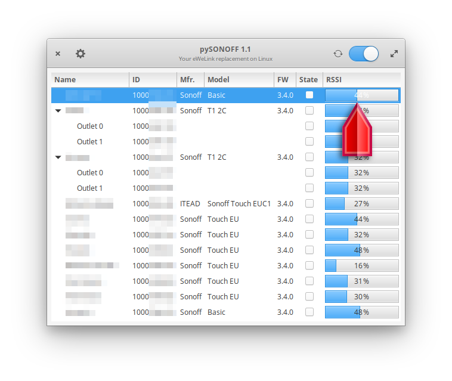

# pySONOFF

This program allows you to control your _**unflashed**_, _**stock**_ SONOFF devices from a Linux computer. It is not working in realtime though, because of the underlying library. This means that you will have to refresh the status of your devices manually. But other than that, it works well and reliably...

## Install

### Requisites

To run this software you need to have the python-sonoff library installed. You may get it from [Lucien2K's Github Page](https://github.com/lucien2k/sonoff-python). Please follow the steps from there to prepare to run pySONOFF.

**UPDATE** since Lucien's repo hasn't been updated for quite a long time, the switching of the devices didn't work anymore. As a workaraound I've taken a user contributed correction of his code ( by marcinlubojanski ) and included it in my repo, since Lucien hasn't made it available in his repo. 

### Copying

* Copy `pySONOFF.py` and `sonoff.py` to the directory of your choice.

* Copy `default.config` to the directory `~/.config/sonoff/default.config`. If the directory does not exist, create it.

* Correct the PATH insde `pySONOFF.desktop` and copy it to `~/.local/share/applications`.

## Usage

### Starting the program

Upon starting pySONOFF, you will be presented with an empty interface like so...

The first time you connecto to your account, it might be a good idea to fill in your accounta data (😜). Therefore, push the config button:

which will then deploy a little bubble to allow you to fill in your data:

The Api key and token will probably appear empty at first but will populate when you first connect successfully to the cloud. These entry fields are read only, you can not modify them...

Once you are done with your data, just click anywhere to close the bubble and your data will be saved for future sessions. You do not have to do anything, it's automagically done.

If you feel you are ready to connect to SONOFF's cloud, slide the connect button to on:

If connection was successful, the treeview will populate with all your devices:

This is the current status of your device-tree. You may switch your devices on or off by toggling the "State" - Checkbox. If you modify the state elsewhere (either manually or from Alexa/Google Home/you name it), the change is not reflected in this treeview. To update to the current situation, push the update button:

The treeview will then populate with the available devices. The treeview gives us the folling info:

The name of the device. If a device has more than one output, it appears as a depolyable node whose outlets are numbered from 0 to X. For each outlet, a name can be defined in the eWeLink app but these names are not transmitted to the cloud. This is the reason why you will only have generic names as child nodes.

The next field is the ID of the device. This number does only matter for internal processing. It is a unique number to identify the device in your network.

After that, the manufacturer and the device model are listed. Whenever a unknown device is detected, an advertisement is logged to the console and I kindly ask you to notify that, so I can add this device to the internal database. If the device is unknown, it may not work properly:

The model number is followed by the firmware version. Right now, it is not possible to update from pySONOFF, but this is something that I have planned for the future.

To change the status of any device, you may click on the checkbox in the "State" column. If you click on a root node, all childs will be set to the root status. If you just want so switch one outlet on, use the checkbox of the child node.

The last column indicates the signal strength in %. 100% would be the theoretical maximum of 0dB, but values around 40% are pretty decent...

And this is it. Please enjoy, and if you can, contribute to make the program even better.

### Based on
`sonoff-python` library by Lucien2K available on [GitHub](https://github.com/lucien2k/sonoff-python)

`pyGObject` library by the GNOME Project available on [Github](https://github.com/GNOME/pygobject)
